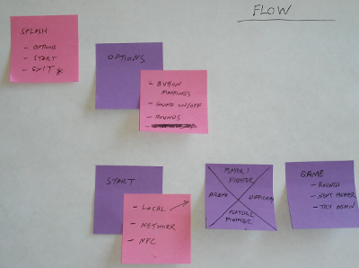
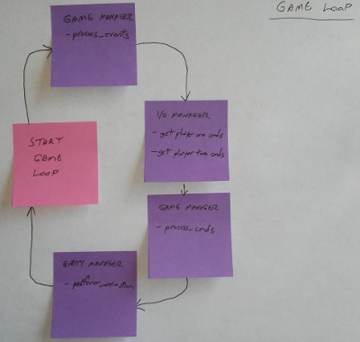

# Kivy GamePad
> Creating a re-useable controller for phones and tablets

The Kivy GamePad is an attempt to create a cross platform on-screen controller that will allow users of any device to have a game console like experience.

## Installing / Getting started

Clone, download, or fork this [repo](https://github.com/randomsilo/kivy-gamepad.git)

```shell
cd gamepad
python3 main.py
```

You should see the kivy startup screen with the game name, game company, start button, and exit button.  Screen shot is pending some actual UI work.

## Developing

Issues will be created with a rough design concept.  If the issue interests you please fork the code, create a working branch, and then make a pull request with the related file changes.

Any accepted pull request will result in your name being added to the list of contributors.  Just remember all code submitted will be MIT Licensed for other people to use, modify, or sell.

### Building

The following packages were used to configure Linux Mint 18.2

```shell
sudo add-apt-repository ppa:kivy-team/kivy

sudo apt-get update

sudo apt-get install python3-kivy
sudo apt-get install python3-kivy-bin
sudo apt-get install python3-kivy-common

# if it is broke
sudo apt-get -f install

# Install necessary system packages
sudo apt-get install -y \
    python-pip \
    build-essential \
    git \
    python3 \
    python3-dev \
    ffmpeg \
    libsdl2-dev \
    libsdl2-image-dev \
    libsdl2-mixer-dev \
    libsdl2-ttf-dev \
    libportmidi-dev \
    libswscale-dev \
    libavformat-dev \
    libavcodec-dev \
    zlib1g-dev

# Install gstreamer for audio, video (optional)
sudo apt-get install -y \
    libgstreamer1.0 \
    gstreamer1.0-plugins-base \
    gstreamer1.0-plugins-good

sudo apt-get install -y python3-sdl2
```

It took some googling to get python3, kivy, and the required libraries to work.  These are the commands as I recorded them.  It might not be efficient or entirely needed but it worked.  Clean up of unused libraries will happen before the initial release.  Be right noe...working is working.

### Deploying / Publishing

Multi player using a digital ocean linux server to connect multiple devices is a goal for this project.  Another goal is NFC between devices in the same room.

```shell
# Nothing at this time
```

## Concept Diagrams




## Features

There are no features yet...only goals.
Hopefully this will change really soon.

Goals:
* UI GamePad Controller
* I/O Manager for GamePad
* EntityManager
* GameManager
* GameEngine

## Contributing

if you want to contribute, please make a pull request.

In order to make that process faster please review the basic style guide and expanded conventions.  If the style recommendations bother you please reach out to have a conversation.  I am always learning and I am open to new ways; but, I need to get started and refactor as necessary.

This is where I am starting in regards to style.

Any and all help is appreciated.  I don't care what level of python experience you have.  If you are open to learning, growing, and working on something fun then we definitely want you.

### Basic Style Guide

[PEP8](https://www.python.org/dev/peps/pep-0008/)

### Expanded Conventions

Area  | Convention | Notes
--- | --- | ---
Interface            | CamelCaseNameInf | Only abstract methods, no implementations
Abstract Base Case   | CamelCaseNameAbc | Extends from interface, no implementations, has common helper functions
Stock Implementation | CamelCaseNameImplStock | Extends ABC, implements INF
Other Implementation | CamelCaseNameImplOther | Extends stock or ABC, implements or overrides methods
Class Name           | CamelCaseNameCls | A stand alone class has Cls on the end of it
Independant Behavior | CamelCaseNameMixIn | A mix in is encapsulated behavior added by inheritance with no intent to modify
Function Name        | lowercase_with_underscores | The word function is used for functions outside of a class
Method Name          | lowercase_with_underscores | The word method is used for functions inside of a class
Private Variables    | _name_typehint | Private class variables with a type hint for clarity: _count_int, _money_float, _name_str, _name_inst (class instance)


## MIT License

<pre>
Copyright 2017 Daniel A. Dawson

Permission is hereby granted, free of charge, to any person obtaining a copy of this software and associated documentation files (the "Software"), to deal in the Software without restriction, including without limitation the rights to use, copy, modify, merge, publish, distribute, sublicense, and/or sell copies of the Software, and to permit persons to whom the Software is furnished to do so, subject to the following conditions:

The above copyright notice and this permission notice shall be included in all copies or substantial portions of the Software.

THE SOFTWARE IS PROVIDED "AS IS", WITHOUT WARRANTY OF ANY KIND, EXPRESS OR IMPLIED, INCLUDING BUT NOT LIMITED TO THE WARRANTIES OF MERCHANTABILITY, FITNESS FOR A PARTICULAR PURPOSE AND NONINFRINGEMENT. IN NO EVENT SHALL THE AUTHORS OR COPYRIGHT HOLDERS BE LIABLE FOR ANY CLAIM, DAMAGES OR OTHER LIABILITY, WHETHER IN AN ACTION OF CONTRACT, TORT OR OTHERWISE, ARISING FROM, OUT OF OR IN CONNECTION WITH THE SOFTWARE OR THE USE OR OTHER DEALINGS IN THE SOFTWARE.
</pre>
